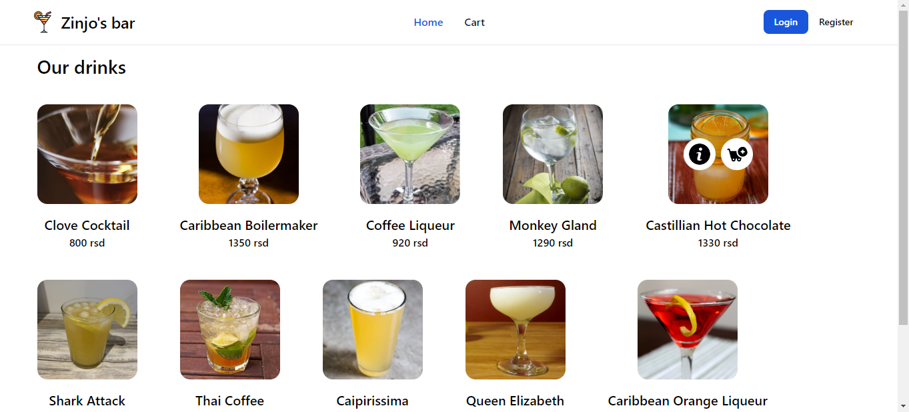
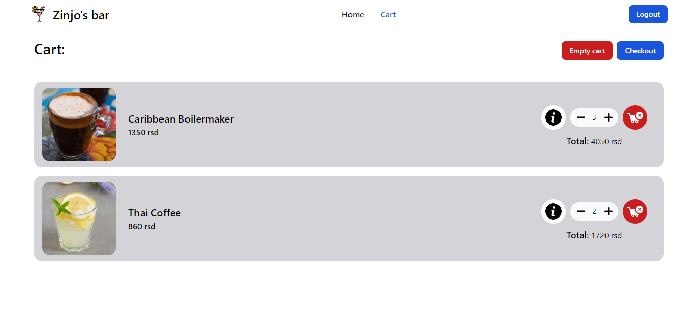

# This is an Node.JS webbapp. 
### Api service is used for database sequalization and route handleing. It is written in JavaScript and uses Express.JS.
### App service is the admin dashboard. It's purpose is to handle creations of new Cocktails, Categories, Ingredients etc.., also to view pending orders. It's written in HTML and CSS and uses Express.JS.
### Auth service is used for authentication of users with JWT. Also it handles creating models for Users using sequelize.
### Vue service is the frontend service for client side of the bar. It's used for displaying all cocktails, checkouts and login/registering. It's written in Vue.JS and uses tailwind for styling.
### To start the app, in root run comand: "npm i", "npm run all:install", then "npm run start:services".

